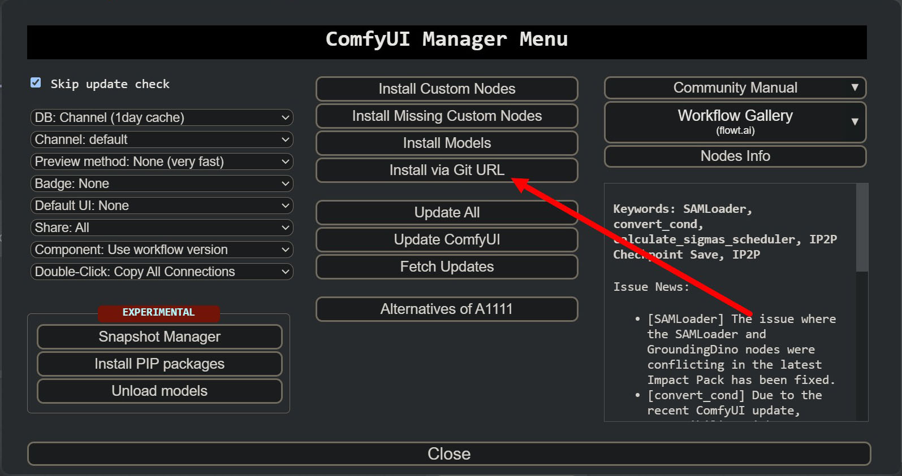

**Прект русской локализации "ComfyUI"**

> Russian localization fork project "ComfyUI"

> 俄罗斯本地化分叉项目“ComfyUI”

---
Локализация **"ComfyUI"** производится без какого-либо вмешательства в код самой **"ComfyUI"**, путем "перехвата строк на лету" и замены определенных, английских "буквосочетаний" на их русские аналоги.
Установка и удаление этого модуля локализации никак не влияет на работоспособность самой **"ComfyUI"** и любых компонентов установленных в системе!

Локализатор устанавливается как обычная нода через "ComfyUI-Manager" - **"Install via Git URL"** и ввода адреса:

- **https://github.com/Nestorchik/NStor-ComfyUI-Translation.git**

  

---

Можно просто скопировать папку с нодой в каталог "custom_nodes".

---

Установка пакетов питона не требуется.
 
---

Модуль начинает работу сразу после перезагрузки питона.

---

Для "нормальной работы с локализованной версией "ComfyUI" требуется установленный "ComfyUI-Manager". В его меню (шестеренка) - пункт **"AGLTranslation-langualge"** выбрать язык **"Русский"**.

  
 
  

---

Переключение языка "Русский/Английский" кнопкой менеджера "Switch Locale/Смена языка". 
Время переключения интерфейса "Русский/Английский" - моментальное.
  

  

---

Проект содержит только русский (и английский) языки, все остальные языки отключены, поскольку он рассчитан только на территорию России. Проект локализации **"AIGODLIKE"** "ru-RU" по соглашению с Китаем берется отсюда, т.е., фактически, официальным проектом русской локализации **"ComfyUI"** является этот git-ресурс. Здесь всегда последние обновления русской локализации для "ComfyUI", публикуются онлайн.

---

Обновление ноды в **"ComfyUI"** (пока) вручную. В терминале открыть папку:

- **"custom_nodes\NStor-ComfyUI-Translation\"**

и находясь именно в этой папке выполнить команду:

- **git pull**

В настоящий момент переведены все встроенные меню, панели, диалоги, названия и т.п., до чего смогли технологически добраться не влезая и не изменяя код самого **"ComfyUI"**, т.к. это считаем необходимым условием доверия к подобного рода софту. Мы никогда не изменяем ни одного знака (даже пробела) в исходном коде, который написан не нами. Любые обвинения типа "До установки вашего приложения все работало, а теперь перестало" являются необоснованными. Ни установка, ни удаление пакета локализации, никак не влияет на работоспособность основной системы.

---

В системе не переводились наименования нод, пунктов входов/выходов, заголовки, пункты настроек и т.п., которые являются общепринятыми привычными для пользователей, знакомых с "ComfyUI". Исключением являются лишь некоторые "обще-понятные" названия.  

---

В дальнейшем планируется локализовать основные популярные ноды и модули. Если вас что-то не устраивает в переводе, или вы начинаете путаться в локализованной версии, просто нажмите кнопку **"Смена языка"** *("Switch locale")*, и произойдет автоматическое переключение на встроенный английский язык. 

---

Уже переведенные ноды (файлы локализации) находятся в папке "ru-RU\Nodes" в файлах с именем, одинаковым с названием ноды, и с расширением **JSON**.

---

Перевод встроенных нод в файле - **internal.json**

---

Для изменения перевода откройте нужный файл и измените русское название на свое, если вам так больше нравится.

---

Для выключения перевода конкретных нод(ы), просто переименуйте нужный файл так, чтобы его имя не совпадало с названием ни одной ноды, установленной в системе, или просто удалите этот файл. После чего перезагрузите питон, и выбранная нода больше переводиться не будет. Для восстановления перевода, просто закиньте одноименный с нодой файл перевода с расширением **JSON**, и перезагрузите питона.

---

Все замечания, предложения в [Telegram](https://t.me/comfyui_rus)

---

Далее - неменого скриншотов переведенного интерфейса:

  
 
  
 
  
 
  
 
  
 
  

---

Удачи! )))

